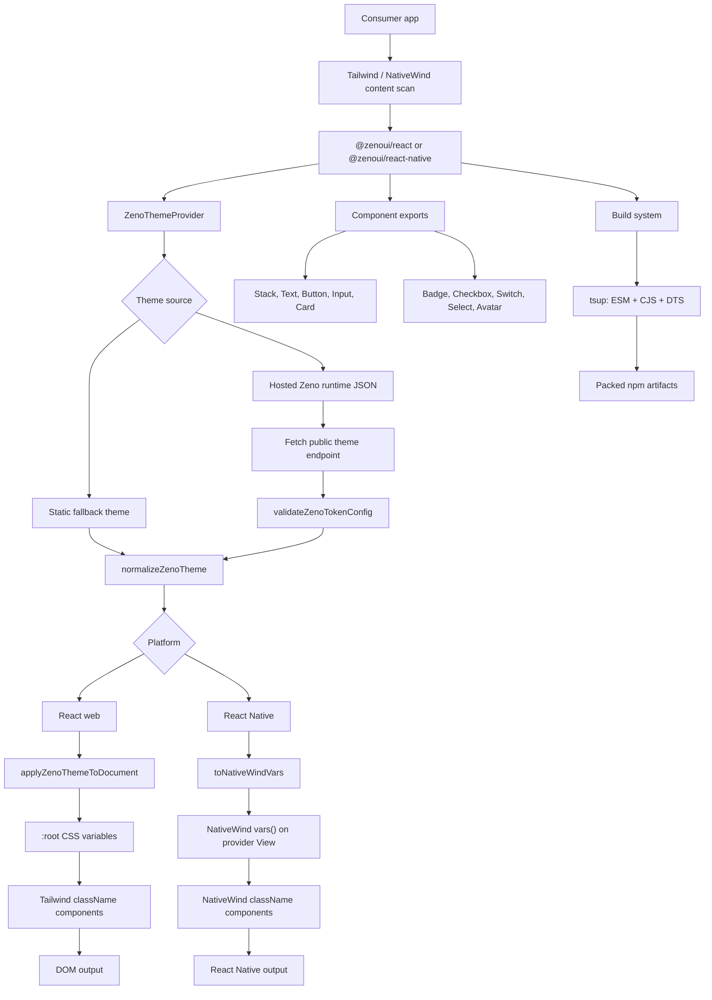

# Zeno UI

Lean, publishable Zeno UI packages for React web and React Native.

GitHub: [ohshinbhat/zeno-ui](https://github.com/ohshinbhat/zeno-ui)
Releases: [github.com/ohshinbhat/zeno-ui/releases](https://github.com/ohshinbhat/zeno-ui/releases)
Actions: [github.com/ohshinbhat/zeno-ui/actions](https://github.com/ohshinbhat/zeno-ui/actions)

## Packages

- [`@zenoui/react`](https://www.npmjs.com/package/@zenoui/react): web primitives, hosted theme provider, and pre-hydration theme script support.
- [`@zenoui/react-native`](https://www.npmjs.com/package/@zenoui/react-native): native primitives and hosted theme provider for React Native apps.

## Install

```bash
npm install @zenoui/react tailwindcss
```

```bash
npm install @zenoui/react-native nativewind tailwindcss
```

## Styling Setup

Zeno components are Tailwind-first. Web components use Tailwind `className` utilities backed by Zeno runtime CSS variables. React Native components use NativeWind `className` utilities and runtime variables from `ZenoThemeProvider`.

Add the package output to your Tailwind content scan:

```ts
// Web tailwind.config.ts
export default {
  content: [
    "./src/**/*.{js,jsx,ts,tsx}",
    "./node_modules/@zenoui/react/dist/**/*.{js,mjs}"
  ]
};
```

```ts
// React Native tailwind.config.ts
export default {
  content: [
    "./App.{js,jsx,ts,tsx}",
    "./src/**/*.{js,jsx,ts,tsx}",
    "./node_modules/@zenoui/react-native/dist/**/*.{js,mjs}"
  ]
};
```

## Architecture



Theme values stay dynamic through the Zeno token contract, while component styling stays static and scanner-friendly through Tailwind on web and NativeWind on React Native.

## Component Surface

Both packages expose the same ten high-leverage primitives:

- `Stack`
- `Text`
- `Button`
- `Input`
- `Card`
- `Badge`
- `Checkbox`
- `Switch`
- `Select`
- `Avatar`

## Web Usage

```tsx
import {
  Avatar,
  Badge,
  Button,
  Card,
  Checkbox,
  Select,
  Stack,
  Switch,
  Text,
  ZenoThemeProvider
} from "@zenoui/react";

export function SettingsPanel() {
  return (
    <ZenoThemeProvider>
      <Card>
        <Stack gap="md">
          <Avatar name="Ada Lovelace" />
          <Badge>Production</Badge>
          <Text variant="title">Theme controls</Text>
          <Select
            label="Density"
            options={[
              { label: "Comfortable", value: "comfortable" },
              { label: "Compact", value: "compact" }
            ]}
          />
          <Checkbox label="Enable previews" defaultChecked />
          <Switch label="Sync published theme" />
          <Button>Save changes</Button>
        </Stack>
      </Card>
    </ZenoThemeProvider>
  );
}
```

## Native Usage

```tsx
import {
  Avatar,
  Card,
  Select,
  Stack,
  Switch,
  Text,
  ZenoThemeProvider
} from "@zenoui/react-native";

export function ProfilePanel() {
  return (
    <ZenoThemeProvider>
      <Card>
        <Stack gap="md">
          <Avatar name="Ada Lovelace" />
          <Text variant="title">Workspace</Text>
          <Select
            label="Mode"
            options={[
              { label: "Light", value: "light" },
              { label: "Dark", value: "dark" }
            ]}
          />
          <Switch label="Sync theme" defaultChecked />
        </Stack>
      </Card>
    </ZenoThemeProvider>
  );
}
```

## Verification

```bash
yarn install
yarn typecheck
yarn build:packages
yarn pack:packages
```

## Release Flow

1. Bump both publishable packages to one shared version:

```bash
yarn release:version <version>
```

2. Verify the release artifacts locally:

```bash
yarn release:check
```

3. Commit the version bump and create a Git tag:

```bash
git add .
git commit -m "Release v<version>"
git tag v<version>
git push origin main --tags
```

4. GitHub Actions publishes both packages from the `v*` tag through the publish workflow in `.github/workflows/publish.yml`.

If you prefer a manual GitHub publish, run the `Publish Packages` workflow from the Actions tab and pass the exact version. The workflow now applies that version inside CI before it builds and publishes.

For tag-based releases, commit and push the version bump first so the tag points at manifests with the same version:

```bash
yarn release:version <version>
git add .
git commit -m "Release v<version>"
git tag v<version>
git push origin main --tags
```

## Trusted Publishing

The publish workflow is set up for npm trusted publishing with GitHub Actions OIDC. It runs on Node 24 so the npm CLI supports trusted publishing, and it strips token auth during the publish step so npm uses OIDC. In npm, connect this repository to each package:

- `@zenoui/react`
- `@zenoui/react-native`

After that, CI can publish without storing an npm token in GitHub secrets.
