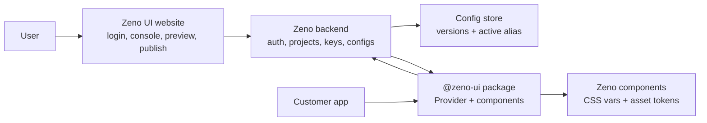
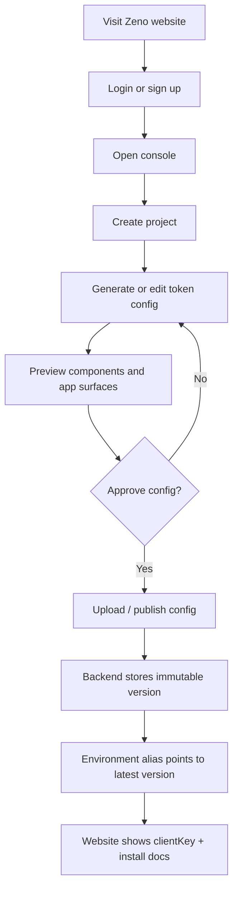
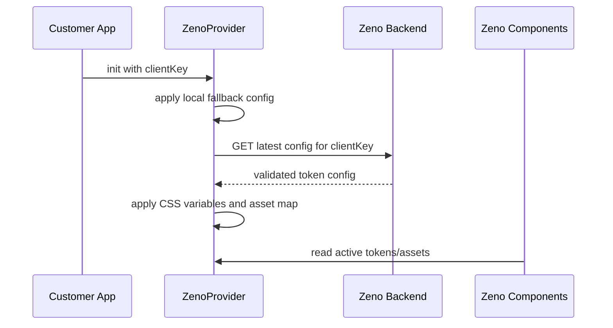
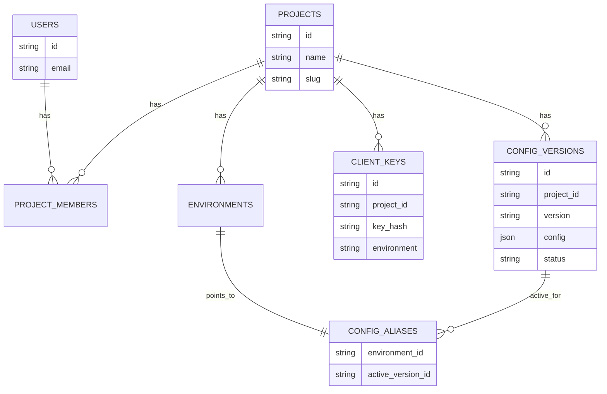
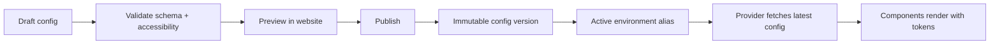
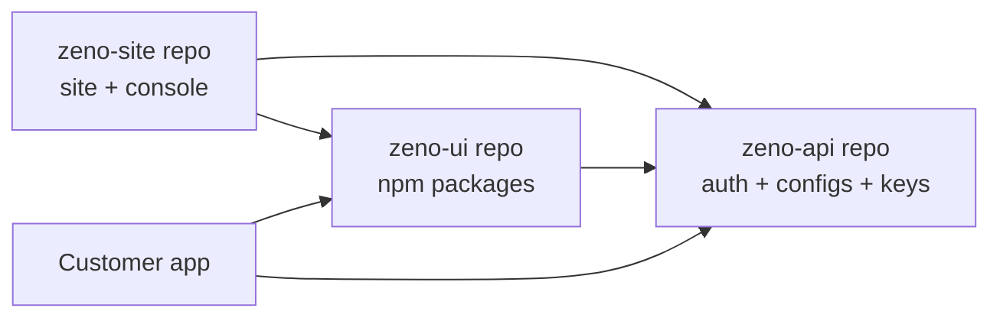

# Zeno Platform Architecture

This document is the editable source of truth for the Zeno product architecture. It is meant for both humans and Codex. When this file changes, implementation should follow it unless the user says otherwise.

## Product Shape

Zeno has three maintained surfaces:

1. `Zeno UI website`
   - Users sign up or log in.
   - Users open a console/playground, generate or edit a token config, preview it, and upload/publish it.
   - Users copy the integration key and package setup instructions.

2. `Zeno UI package`
   - Customers install the package in their app.
   - Customers wrap their app with the Zeno provider and pass a key from the website.
   - The provider fetches the latest active config from the backend.
   - Zeno components read the applied tokens and assets.

3. `Zeno backend`
   - Stores users, projects, environments, keys, config versions, and active aliases.
   - Accepts uploaded/generated configs from the website.
   - Serves the latest validated config to customer apps at launch.

## System Diagram



## Website User Flow



## Customer App Flow



## Key Model

The customer app needs a key that can safely live in frontend code. Use these terms:

- `clientKey`: public key copied from the website and passed to `ZenoProvider`. It can only read the active config for an allowed project/environment.
- `publishKey`: private key for server-side upload/publish flows when API publishing is needed outside the website.
- `website session`: authenticated user session for console actions like editing, previewing, and publishing.

Do not treat the provider key as a secret. It is a read key.

Example package setup:

```tsx
import { ZenoProvider } from "@zeno-ui/react";
import "@zeno-ui/react/styles.css";

export function App() {
  return (
    <ZenoProvider clientKey="zk_live_example">
      <YourRoutes />
    </ZenoProvider>
  );
}
```

## Backend Responsibilities

The backend owns:

- User auth and project membership.
- Project creation and dashboard state.
- `clientKey` creation, rotation, and environment assignment.
- Config upload and validation.
- Immutable config versions.
- Active config alias per environment, such as `production`, `staging`, or `preview`.
- Public read endpoint used by the provider.

Core backend records:



## Package Responsibilities

The package owns:

- `ZenoProvider` / app init.
- Fetching the latest config by `clientKey`.
- Local fallback config for first paint and failed network.
- Cache of the last valid config.
- Applying token CSS variables and asset map.
- Components that consume semantic tokens, not hardcoded brand styles.

Package expectations:

1. Customer installs Zeno.
2. Customer copies a `clientKey` from the website.
3. Customer wraps the app with the provider.
4. Customer uses Zeno components.
5. Provider fetches and applies the latest config.
6. Components visually update without the customer redeploying for every theme change.

## Config Lifecycle



Rules:

- Config is the source of truth for theme and assets.
- Published config versions are immutable.
- Environments point to an active version.
- Provider reads by `clientKey`, not by user auth.
- Components read tokens through provider-applied CSS variables and asset context.

## Repository Plan

The long-term product should be split into separate repositories. The current repo should become the package/library repo, while the website and backend move into their own repos.

```text
zeno-ui/                   # Package repo
  packages/react           # Components + public provider export
  packages/theme-runtime   # Runtime loading, caching, app init, CSS application
  packages/tokens          # Config schema, defaults, validation, migrations
  packages/theme-engine    # Prompt/AI/deterministic theme generation
  packages/tailwind-preset # CSS and Tailwind exporters
  packages/nativewind-preset
  packages/animations
  docs/

zeno-site/                 # Product website repo, currently at ~/Desktop/zeno-site
  marketing site
  login / sign-up
  logged-in console
  config generator and preview UI
  project dashboard
  publish UX
  install instructions and clientKey display

zeno-api/                  # Future backend repo
  auth integration
  projects and membership
  clientKey and publishKey management
  config upload / validation / versioning
  active environment aliases
  public provider read endpoint
  database migrations
```



Repo ownership rules:

- `zeno-ui` owns package APIs, component behavior, token schema, runtime provider behavior, and package docs.
- `zeno-site` owns user-facing flows: auth screens, console, generator UX, config preview, project dashboard, and integration instructions.
- `zeno-api` owns persistence, auth enforcement, keys, versioning, active aliases, and public config fetch endpoints.
- Website and API can depend on published `@zeno-ui/tokens` for config validation. They should not copy token schema logic.
- The package runtime can call the public backend endpoint, but it should not import backend code.
- The website can use the package components and runtime for preview, but it should not own package implementation.

Migration path from this repo:

1. Keep building package/runtime/schema work in `zeno-ui`.
2. Keep website/console code in `~/Desktop/zeno-site`.
3. Keep package/runtime/schema code in `~/Desktop/zeno-ui`.
4. When config persistence and key management harden, create `zeno-api`.
5. Move website API route behavior into `zeno-api` and keep compatibility URLs or redirects if already used.
6. Keep this architecture doc mirrored or linked from the website and API repos so Codex can preserve cross-repo context.

Optional later repo:

- `zeno-infra` for Terraform, environments, CI/CD, observability, and secrets management if deployment complexity grows.

## Codex Maintenance Rules

Codex should use this file as architecture context before making changes to:

- Login/signup or console user flows.
- Provider API or package setup.
- Config schema, validation, or publish flow.
- Backend storage, key model, or fetch endpoints.
- Component token consumption.

When implementation changes any of those areas, update this document in the same change.

If the user edits this document, Codex should treat the edited architecture as the desired product direction and align implementation to it.
